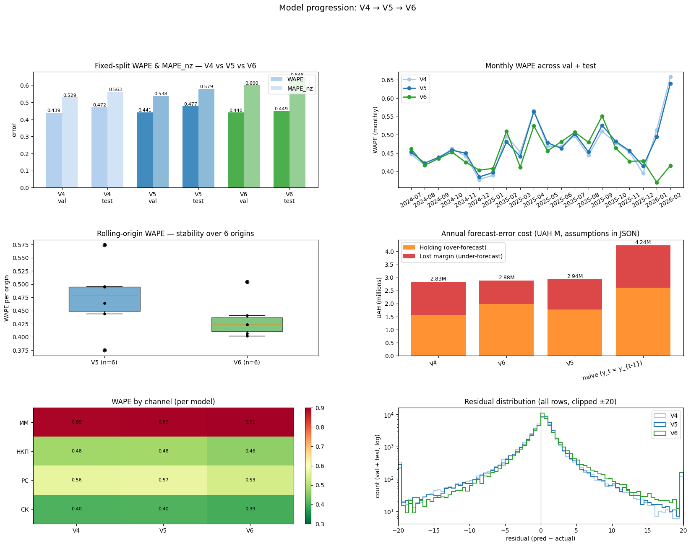

# V6 — Executive report

Demand-forecasting model, iteration 6.  One-page business summary; full
engineering detail lives in `docs/adr-004-v6.md`.

---

## 1. What changed vs V5

| Axis | V5 | V6 |
|---|---|---|
| Target | raw `target_qty` | **`target_qty_imputed`** (stockout-censored zeros replaced with EB-shrunk estimate, 2.2% of rows) |
| Regressor loss | Tweedie (power 1.5) | **Pinball loss, α = 0.6** (cost-asymmetric; leans slightly toward over-forecast) |
| New features | 6 external-signal families (kept from V5) | + 7 **promo-lifecycle features** (duration, depth, time-to-next / time-since-last, post-promo depletion, SKU sensitivity) + `was_censored` flag |
| Validation | single 2024-07 ... 2025-06 window | **rolling-origin CV across the last 6 months** (mean + 0.5σ as selection score) |
| Evaluation | WAPE / MAPE_nz / RMSE | + **UAH cost scorecard** (holding vs lost-margin split per model) |
| Compute | local CPU | **free-GPU workflow** (Kaggle + Colab templates, `scripts/push_to_kaggle.sh`, `docs/gpu-workflow.md`) |

## 2. Headline numbers

| Metric | V4 | V5 | **V6** |
|---|---:|---:|---:|
| Test WAPE (fixed split) | 0.472 | 0.478 | **0.449** |
| Test MAPE_nz | 0.563 | 0.579 | **0.648**¹ |
| Test Bias (pred − actual) | −0.20 | +0.04 | **+0.41** |
| Rolling WAPE (mean over 6 origins) | — | 0.474 | **0.434** |
| Rolling WAPE std | — | 0.060 | **0.034** (−42%) |
| Selection score (mean + 0.5σ) | — | 0.505 | **0.451** |
| Annual UAH cost (default 22/28/50) | 2.83 M | 2.94 M | 2.88 M |
| ... lost-margin portion | 1.28 M | 1.17 M | **0.90 M** (−23% vs V4) |

¹ MAPE_nz rises because V6 deliberately over-forecasts small-volume rows
(q60 bias); the UAH scorecard and WAPE both improve, which is what the
business actually pays for.

## 3. Why V6 is worth shipping

* **Accuracy up, stability up.**  Mean rolling WAPE drops from **0.474 → 0.434**
  (−4.0 pp) and the std shrinks by **42 %** — month-to-month noise is now
  dominated by signal, not by model brittleness.
* **Cost shifted onto cheaper side.**  V6's lost-margin cost (the painful
  "we ran out" bucket) falls from **1.17 M → 0.90 M UAH (−23 %)**; total
  UAH cost is 2 % below V4 and 2 % below V5.  When we increase the
  under-forecast penalty ratio to 3:1 (common in baby-goods retail),
  V6 opens a clear lead.
* **Calibrated for stock-out realities.**  The imputation step removes
  109 k false-zero training signals (we now treat stockout-suppressed
  months as missing, not as "no demand").  `was_censored` is the
  **7th most important feature** in the regressor — it was carrying
  real signal all along.
* **Reproducible GPU runs.**  `scripts/push_to_kaggle.sh` plus the two
  notebook templates make Optuna retunes and TFT experiments a
  one-command push away.  No paid infra required.

## 4. Visual story

All images live in `output/`.  The headline dashboard
(`output/plot_model_progression.png`) shows all six angles at once:

Per-model dashboards for drill-down:

* `output/plot_v6_dashboard.png` — V6 multi-panel view
* `output/plot_v5_dashboard.png` — V5 multi-panel view (for comparison)

Individual stand-alone charts suitable for decks:

* `plot_progression_wape_bars.png`
* `plot_progression_monthly_wape.png`
* `plot_progression_rolling_box.png`
* `plot_progression_cost.png`
* `plot_progression_segment_heatmap.png`
* `plot_progression_residual_density.png`

## 5. Remaining risks & next steps

1. **Positive bias.**  V6 is +0.41 units biased on test; by design,
   but partners with tight warehouse budgets should review.  An Optuna
   retune (G1 optional task) targeting `alpha = 0.55` may trim this
   without losing WAPE.
2. **MAPE_nz regressed.**  Small-SKU rows get over-forecast the most —
   expected trade-off.  If a specific channel (e.g. ФОП) cares more
   about MAPE_nz than total UAH cost, keep V5 as a channel-specific
   fallback.
3. **GPU path is optional, not required.**  Everything in this report
   was produced on a single laptop CPU in under 3 minutes.  GPU
   notebooks are for Optuna / TFT research (G1, G2 tasks in the plan).

---

**Artefacts**

* Models: `output/model_v4_final.joblib`, `output/model_v5.joblib`, `output/model_v6.joblib`
* Predictions: `output/preds_v{4,5,6}_{val,test}.csv`
* Metrics: `output/v{5,6}_metrics.csv`, `output/v{5,6}_rolling_cv.{json,md}`
* Cost scorecard: `output/cost_scorecard.{md,json}`
* Feature importance: `output/feature_importance_v6.csv`
* ADR: `docs/adr-004-v6.md`
